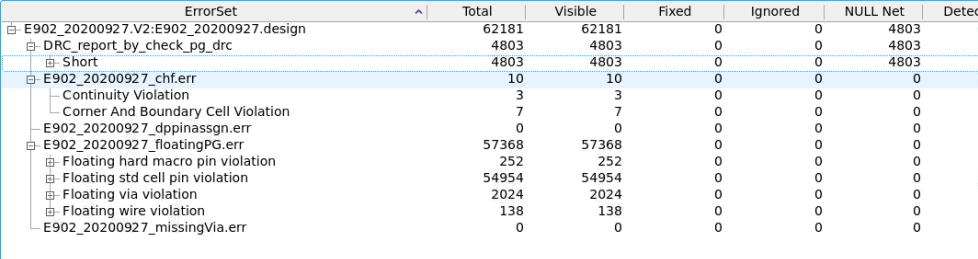
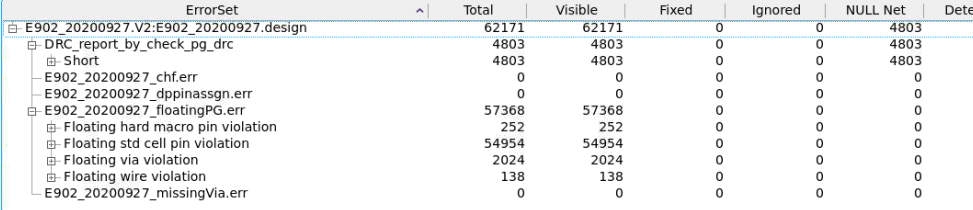
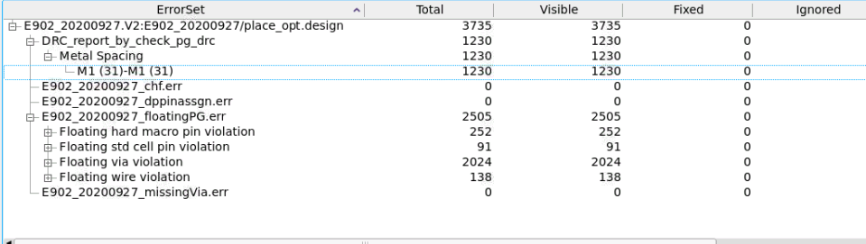
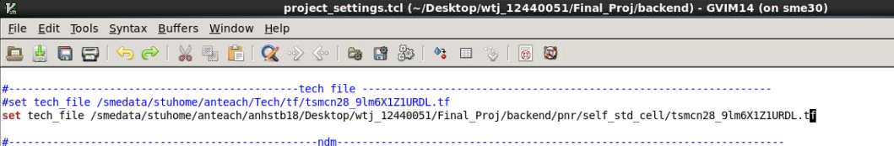
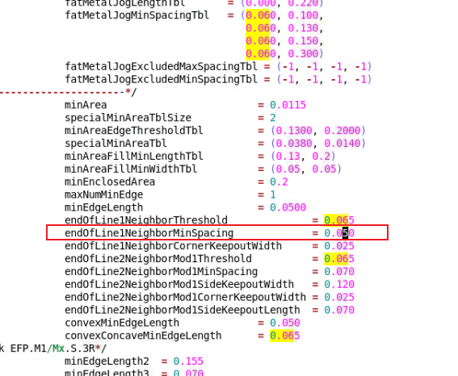
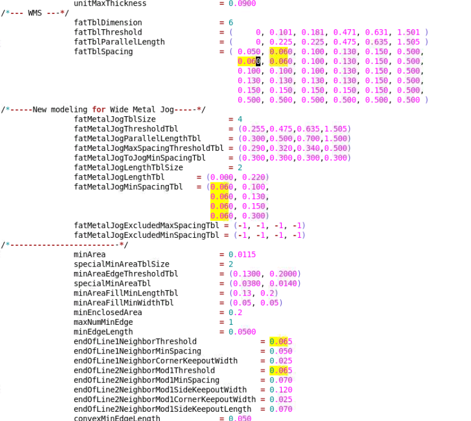
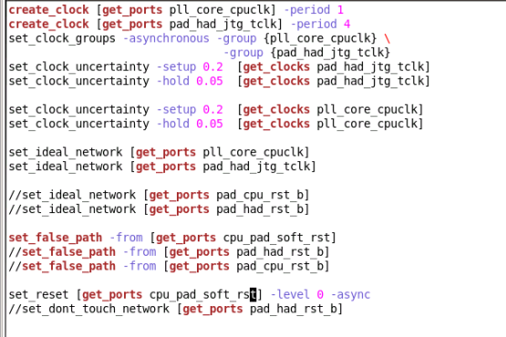

## 2025.5.24 e902 pnr
### 现在V1是一点没改从头跑到尾的
V1的整个面积大概是340x340左右 OFFSET = 5

### V2缩小一点面积试试
* ``` initialize_floorplan -control_type die -boundary {{0 0} {300 280}} -core_offset 5 ```
* ``` place_pins -ports [get_ports *] ```
* ``` source ./user_scripts/floorplan.tcl ```
然后``` check_pg_connectivity check_pg_drc check_pg_missing_vias ```
打开错误报告如下

打开``` create_boundary_tap.tcl ```, 再运行一次里面的命令
再看错误报告，

第一步结束，save block为init_design
丸辣，都开始跑placement了，想起来没有限制区域内的布局密度
跑完run_pr第二条命令，打开UI
然后``` check_pg_connectivity check_pg_drc check_pg_missing_vias ```
看错误报告


.lef文件存的是std cell的layout信息，.tf文件存的是drc规则
把.tf 工艺文件copy到了/pnr/self_std_cell里面，自己修改一下，同时改了icc2调用的tf路径（在project_setting里面改）

把M1的这个eod1从0.06改成0.05

由于不知道改哪个，那就把0.06全改0.05

metal spacing 的error真的没有了
现在回退，看看具体是哪个0.06影响的这个东西
现在只把end0line1neighbor那个从0.06改成0.05，看看有什么区别。（另外几个0.06没改）

现在V2是改过面积但是没改过工艺库tf文件的，亲测有metal spacing error。
V3把eod1从0.06改成0.05测试，亲测有效。
现在用V3把后面几步一起跑了
V3全跑完了没啥其它的error，只有两个lvs和一堆floating

现在弄个V4 面积再调小

现在的V5已经是极限尺寸了，感觉再小要爆炸了

现在把syn里面的sdc文件改成了 old.sdc文件，然后把E902自带的sdc拿进来（改名成E902_20200927.sdc），进行dc综合测试一下
在跑dc了
现在dc/self_result_temp里放的是一开始用的理想约束跑的dc结果

dc约束改成这样跑下dc试试
